# Nifty 500 Scanner — Implementation Plan

**Version**: 2.3.0 | **Last Updated**: 2026-08-22

---

## 1. Architecture Overview

Unified Streamlit application (`streamlit_app.py`), running locally or on Streamlit Cloud, zero third-party cloud/API dependencies.

```
Browser (Desktop / Mobile Client)
        ▲
        │ Websocket Connection
        ▼
Streamlit Server (streamlit_app.py) — port 8501/8502
        │
        ├── Session & Theme Engine     → st.session_state (Dark / Light mode)
        ├── get_nifty500_symbols()     → NSE CSV (3-URL fallback chain)
        ├── download_prices()          → yfinance batch (80/batch), Parquet cache
        ├── get_benchmark()            → Nifty 500 (^CRSLDX / ^NSEI fallback)
        ├── calculate_metrics()        → per-stock OHLCV → indicators
        ├── score_candidates()         → Momentum + Entry + Final Score
        └── style_dataframe()          → Theme-aware styling + TradingView deep links
                │
                └── Render Hero, KPIs, Controls & Dataframe
```

### 1.1 End-to-End Pipeline Flow Diagram

```mermaid
flowchart TD
    Start(["User clicks 'Run Full Scan'"]) --> FetchSym["1. Symbol Resolution\n(get_nifty500_symbols)\nNifty Indices CSV / GitHub fallback"]
    FetchSym --> CheckCache{"2. Daily Parquet Cache exists?\n(cache/prices_YYYY-MM-DD.parquet)"}
    
    CheckCache -- "Yes (Cache Hit)" --> ReadParquet["Read 3Y Daily OHLCV from Disk\n(< 2 seconds)"]
    CheckCache -- "No (Cache Miss)" --> DownloadYF["Download 500 Tickers via yfinance\n(80 tickers/batch, multi-threaded ~60s)"]
    DownloadYF --> SaveParquet["Save to Parquet Cache"]
    SaveParquet --> ReadParquet

    ReadParquet --> FetchBench["3. Fetch Benchmark (^CRSLDX / ^NSEI)\nCompute 3M & 6M Market Returns"]
    FetchBench --> MetricsEngine["4. Multi-Timeframe Metric Engine\n• Resample to Weekly (W-FRI) → Weekly RSI(14)\n• Resample to Monthly (ME) → Monthly RSI(14)\n• Daily EMA 20/50/200, ADX(14), ATR(14)\n• 20D Volume Ratio, 52W High Distance\n• Relative Strength vs Nifty 500"]

    MetricsEngine --> Layer1{"5. Layer 1: Hard Eligibility Filter\n• Monthly RSI ≥ min_m\n• Weekly RSI ≥ min_w\n• Daily RSI ≥ min_d\n• Price > EMA20 > EMA50 > EMA200\n• ADX ≥ min_adx\n• 52W Dist ≤ max_52w\n• 3M & 6M Returns > 0"}

    Layer1 -- "Passes" --> Layer2["6. Layer 2: Composite Scoring\n• Momentum Score (60%)\n• Entry Score (40%)\n• Final Score = 0.60*M + 0.40*E"]
    Layer1 -- "Fails" --> Discard["Discard Stock"]

    Layer2 --> RRGate{"7. Minimum Risk/Reward Gate\n(R:R ≥ 1.5)"}
    RRGate -- "Yes" --> Rank["8. Rank Top N Candidates\nCompute 6 KPI Summary Metrics"]
    RRGate -- "No" --> Discard

    Rank --> Render["9. Interactive UI Presentation\n• Theme-Aware style_dataframe (Dark / Light)\n• Clickable TradingView Chart Deep Links\n• JetBrains Mono Typography\n• One-Click CSV Export"]
```



---

## 2. Application Controls & Logic (`streamlit_app.py`)

### 2.1 Scanner Parameters

| Parameter | Default | Description |
|---|---|---|
| `min_m` | 60 | Minimum Monthly RSI |
| `min_w` | 60 | Minimum Weekly RSI |
| `min_d` | 50 | Minimum Daily RSI |
| `min_adx` | 20 | Minimum ADX |
| `max_52w` | 10 | Max % distance from 52W high |
| `top_n` | 20 | Number of results to return |

### 2.2 Dual-Theme Engine

- **State Management**: `st.session_state.theme` initialized to `"dark"`.
- **Theme Dictionaries**: `DARK` and `LIGHT` dictionaries providing complete color palettes (backgrounds, text, card borders, badges, buttons, step numbers).
- **Dynamic CSS Injection**: Injects theme tokens dynamically on every rerun via Python formatted CSS.
- **Top Navigation Switcher**: Secondary pill button (`☀️ Light Mode` / `🌙 Dark Mode`) in top bar.

### 2.3 Indicator Functions

| Function | Description |
|---|---|
| `rsi(s, period=14)` | Wilder's EMA-based RSI |
| `ema(s, period)` | Exponential Moving Average |
| `atr(df, period=14)` | Average True Range |
| `adx(df, period=14)` | True ADX with DM+/DM- |

### 2.4 Scoring Functions

| Function | Spec Section |
|---|---|
| `rsi_score(x, kind)` | §3.2a — RSI discrete table (monthly/weekly/daily) |
| `calc_trend_score(price, e20, e50, e200)` | §3.2a — 15/12/8/0 EMA alignment grades |
| `calc_rs_score(rs_decimal)` | §3.2a — RS discrete bucket (>+20%=5 … <0=0) |
| `calc_price_vs_ema20_score(price, e20)` | §3.2b Entry — distance above EMA20 |
| `calc_breakout_pullback_score(...)` | §3.2b Entry — breakout/pullback pattern + volume |
| `calc_rr_score(rr_ratio)` | §3.2b Entry — R:R quality score |

### 2.5 Data Pipeline

```
get_nifty500_symbols()
    → download_prices()         [cache: cache/prices_YYYY-MM-DD.parquet]
    → get_benchmark()           [^CRSLDX → ^NSEI fallback]
    → calculate_metrics()       [per stock row]
    → Hard Filter (Layer 1)
    → score_candidates()        [Momentum + Entry + Final Score]
    → R:R ≥ 1.5 filter
    → top_n results + Rank column
    → style_dataframe(theme)
    → Render interactive view
```

### 2.6 Output Columns

`Rank, Symbol, Action, Price, Final Score, Momentum Score, Entry Score, Monthly RSI, Weekly RSI, Daily RSI, ADX, Vol Ratio, RR Ratio, Risk %, 3M Return, 6M Return, RS vs Nifty, 52W Distance, Stop Loss, Target 2%, Target 5%`

---

## 3. UI Design Architecture (`streamlit_app.py`)

### 3.1 Layout & Responsiveness
- **Desktop**: Centered `.block-container` constrained to `1040px` with auto-margins to avoid ultra-wide monitor stretching.
- **Mobile**: Seamless full-width expansion (`100%`) with customized `@media (max-width: 640px)` queries for font scaling and card grids.
- **Navigation & Controls**:
  - Hidden Streamlit sidebar via CSS to provide consistent, predictable UI on Android, iOS and Desktop.
  - Inline `st.expander` for Scanner Controls with 3-column responsive layout.

### 3.2 Key Dashboard Components
- **Top Nav**: Theme switcher button positioned cleanly in top-right.
- **Hero Header**: Live pulsing badge, gradient title, market metadata (Nifty 500, timeframes, benchmark, timestamp).
- **KPI Summary Grid**: 6 metric cards displaying BUY signals, Watchlist count, Top Score, Average R:R, and Qualified count.
- **Interactive Results Table**:
  - `style_dataframe(df, theme)` provides custom styling with WCAG-compliant contrast in both Dark and Light modes.
  - Monospace font (`JetBrains Mono`) for financial figures.
  - Clickable TradingView NSE chart URLs.

---

## 4. Key Design Decisions

| Decision | Rationale |
|---|---|
| Unified Streamlit monolith (`streamlit_app.py`) | Streamlines deployment to Streamlit Cloud and local desktop execution in 1 command |
| Inline expander controls (no sidebar) | Ensures controls are always visible on mobile devices where sidebars auto-collapse |
| Max-width desktop container (`1040px`) | Prevents dashboard distortion on high-res / ultra-wide monitors |
| Theme-aware `style_dataframe(theme)` | Guarantees high readability in both Dark and Light modes without blinding neon fonts |
| Daily Parquet cache keyed by date | Reduces 500-ticker download from ~60s to <2s on subsequent same-day runs |

---

## 5. Deployment

```bash
# Install dependencies
pip install -r requirements.txt

# Run server
streamlit run streamlit_app.py
# → http://localhost:8501
```
