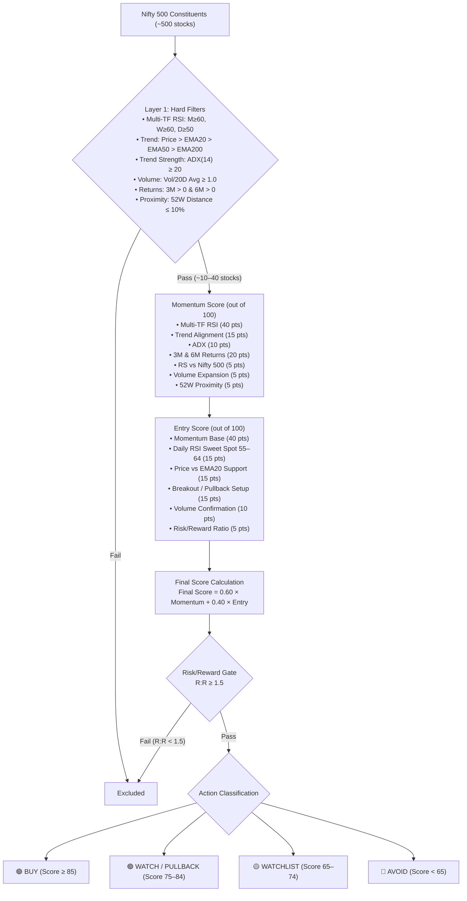
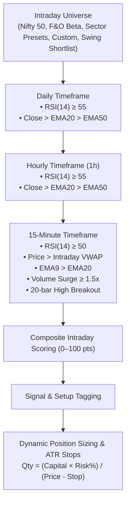

# Nifty Momentum & Intraday Scanner Specification

**Version**: 2.4.0 | **Last Updated**: 2026-08-22

---

## 1. Problem Statement

Traders and quantitative analysts need a fast, reliable, and programmatic screener for Indian NSE equities that provides:
1. **Swing Trading shortlists** across all Nifty 500 stocks based on multi-timeframe momentum alignment (Daily, Weekly, Monthly) and entry timing.
2. **Intraday Trading candidates** based on real-time Multi-Timeframe sync (Daily $\to$ Hourly $\to$ 15-Minute) with VWAP, volume surges, ATR stops, and dynamic position sizing.

---

## 2. Target Audience & Use Cases

- **Swing Traders**: Scanning the full Nifty 500 universe post-market for high-probability 2–5% multi-day swing setups.
- **Intraday Traders**: Scanning liquid universe subsets during market hours for 15-minute VWAP breakout setups and automated risk/quantity sizing.

---

## 3. Mode 1: Swing Momentum Scanner (D · W · M)

### 3.1 Architecture Overview

### 3.2 Layer 1 — Hard Filters
- Monthly RSI(14) $\ge 60$, Weekly RSI(14) $\ge 60$, Daily RSI(14) $\ge 50$.
- Price > EMA20 > EMA50 > EMA200.
- ADX(14) $\ge 20$.
- Volume / 20-day avg volume $\ge 1.0$.
- 3-Month & 6-Month Returns $> 0$.
- Distance from 52-Week High $\le 10\%$.

### 3.3 Layer 2 — Composite Scoring
- **Momentum Score (100 pts)**: Monthly RSI (15), Weekly RSI (15), Daily RSI (10), Trend Structure (15), ADX (10), 3M Return (10), 6M Return (10), RS vs Nifty 500 (5), Volume Ratio (5), 52W Distance (5).
- **Entry Score (100 pts)**: Momentum Base (40 pts), Daily RSI setup (15), Price vs EMA20 (15), Breakout/Pullback (15), Volume confirmation (10), Risk/Reward (5).
- **Final Score**: `0.60 × Momentum Score + 0.40 × Entry Score`.
- **R:R Gate**: Setups with R:R $< 1.5$ excluded.

---

## 4. Mode 2: Intraday Multi-Timeframe Scanner (Daily · 1h · 15m)

### 4.1 Architecture Overview

### 4.2 Intraday Multi-Timeframe Scoring Matrix

| Timeframe | Factor | Points | Condition |
|---|---|---|---|
| **Daily** | Daily RSI | 30 / 27 / 22 | $\ge 70 \to 30$, $\ge 60 \to 27$, $\ge 55 \to 22$, else 0 |
| **Daily** | Daily Trend | 8 | $\text{Close} > \text{EMA20} > \text{EMA50}$ |
| **Hourly** | Hourly RSI | 20 / 17 / 14 | $\ge 65 \to 20$, $\ge 60 \to 17$, $\ge 55 \to 14$, else 0 |
| **Hourly** | Hourly Trend | 5 | $\text{Close} > \text{EMA20} > \text{EMA50}$ |
| **15-Minute** | 15m RSI | 20 / 17 / 13 | $\ge 60 \to 20$, $\ge 55 \to 17$, $\ge 50 \to 13$, else 0 |
| **15-Minute** | VWAP Support | 5 | $\text{Price} \ge \text{VWAP}$ |
| **15-Minute** | 20-Bar Breakout | 5 | $\text{Price} > \text{High}_{[-21:-1].\max()}$ |
| **15-Minute** | Volume Surge | 10 / 8 / 5 | $\text{Vol Ratio} \ge 2.0\text{x} \to 10$, $\ge 1.5\text{x} \to 8$, $\ge 1.2\text{x} \to 5$ |
| **15-Minute** | 15m Trend | 5 | $\text{Price} > \text{EMA9} > \text{EMA20}$ |
| **Total** | **Max Score** | **100** | Capped at 100.0 pts |

### 4.3 Intraday Signals & Setups

| Signal | Requirement |
|---|---|
| `🟢 STRONG BUY CANDIDATE` | Hard MTF filters pass + Intraday Score $\ge 85$ |
| `🟢 BUY ON CONFIRMATION` | Hard MTF filters pass + Intraday Score $\ge 75$ |
| `🟡 WATCH` | Intraday Score $\ge 65$ |
| `🔴 NO TRADE` | Intraday Score $< 65$ |

| Setup Tag | Trigger Rules |
|---|---|
| `⚡ BREAKOUT` | Price > Prior 20-bar 15m High + Above VWAP + Volume Ratio $\ge$ multiplier |
| `🌊 VWAP MOMENTUM` | Above VWAP + EMA9 > EMA20 + 15m RSI $\ge 50$ |
| `🔄 PULLBACK / RECLAIM` | Above VWAP + 15m RSI $\ge 50$ |
| `⏳ WAIT` | Awaiting confirmation |

### 4.4 Intraday Risk Management & Position Sizing
- **Stop Loss**: $\text{Price} - (\text{ATR Multiplier} \times \text{ATR}_{15m})$
- **Target 1**: $\text{Price} \times 1.01$ (+1.0%)
- **Target 2**: $\text{Price} \times 1.02$ (+2.0%)
- **Position Sizing Formula**:
  $$\text{Quantity} = \left\lfloor \frac{\text{Capital} \times (\text{Risk \%} / 100)}{\text{Price} - \text{Stop Loss}} \right\rfloor$$

---

## 5. UI & Presentation Specifications

- **Dual-Theme Engine**:
  - **Dark Terminal Theme**: `#050b14` background, `#00ff88` accents, glassmorphic cards.
  - **Light Mode**: `#f8fafc` background, slate-900 typography, accessible emerald/amber/blue/crimson palette (WCAG AAA).
- **Navigation**:
  - Top-level Mode Switcher (`🚀 Swing Momentum` vs `⚡ Intraday MTF`).
  - Secondary pill theme toggle (`☀️ Light Mode` / `🌙 Dark Mode`).
- **Typography**: Inter for interface elements; **JetBrains Mono** for all numerical values, prices, indicators, and tables.
- **Deep Links**: All stock tickers render as direct clickable TradingView NSE chart links (`https://in.tradingview.com/chart/?symbol=NSE:<SYMBOL>`).
- **Interactive Deep Dive**: 15-minute price vs VWAP, EMA9, and EMA20 line charts with live position sizing summary cards.
- **Exporting**: One-click dated CSV download for both Swing and Intraday results.
