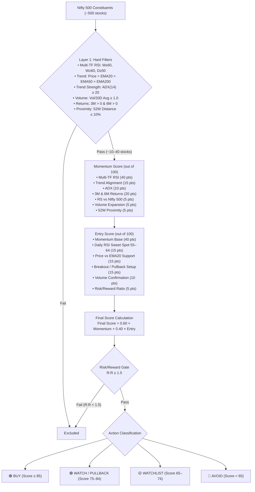
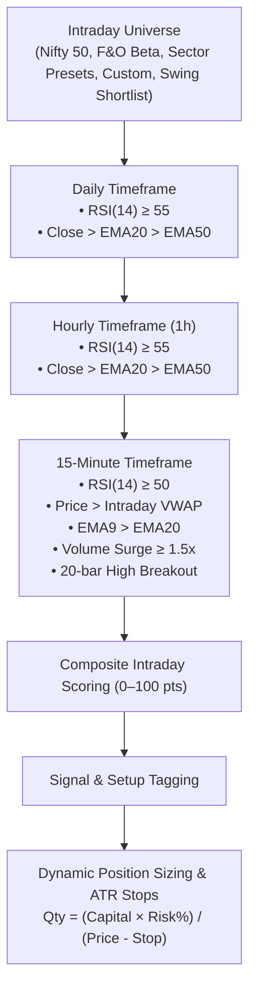
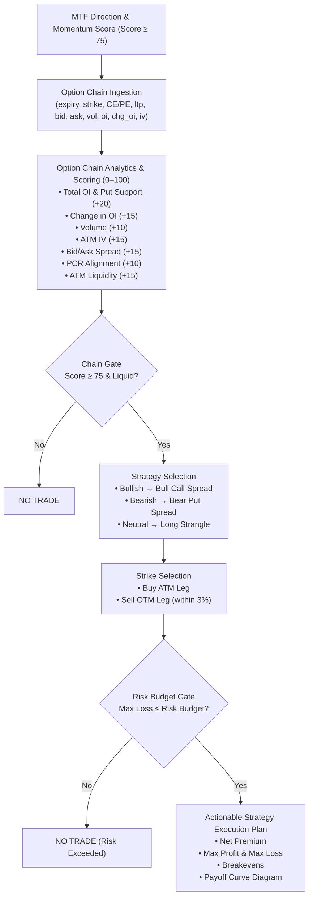

# Nifty Momentum, Intraday & Options Scanner Specification

**Version**: 2.5.0 | **Last Updated**: 2026-08-23

---

## 1. Problem Statement

Traders and quantitative analysts need a fast, reliable, and programmatic screener for Indian NSE equities that provides:
1. **Swing Trading shortlists** across all Nifty 500 stocks based on multi-timeframe momentum alignment (Daily, Weekly, Monthly) and entry timing.
2. **Intraday Trading candidates** based on real-time Multi-Timeframe sync (Daily $\to$ Hourly $\to$ 15-Minute) with VWAP, volume surges, ATR stops, and dynamic position sizing.
3. **Options Strategy Recommendations** gated by MTF Momentum Score ($\ge 75$) and Option Chain Quality Score ($\ge 75$), outputting predefined risk spreads, strike pairings, and payoff simulations.

---

## 2. Target Audience & Use Cases

- **Swing Traders**: Scanning the full Nifty 500 universe post-market for high-probability 2–5% multi-day swing setups.
- **Intraday Traders**: Scanning liquid universe subsets during market hours for 15-minute VWAP breakout setups and automated risk/quantity sizing.
- **Derivatives & Options Traders**: Finding liquid, high-probability options spreads (Bull Call Spreads, Bear Put Spreads, Long Strangles) with defined risk-reward profiles.

---

## 3. Mode 1: Swing Momentum Scanner (D · W · M)

### 3.1 Architecture Overview

### 3.2 Layer 1 — Hard Filters
- Monthly RSI(14) $\ge 60$, Weekly RSI(14) $\ge 60$, Daily RSI(14) $\ge 50$.
- Price > EMA20 > EMA50 > EMA200.
- ADX(14) $\ge 20$.
- Volume / 20-day avg volume $\ge 1.0$.
- 3-Month & 6-Month Returns $> 0$.
- Distance from 52-Week High $\le 10\%$.

### 3.3 Layer 2 — Composite Scoring
- **Momentum Score (100 pts)**: Monthly RSI (15), Weekly RSI (15), Daily RSI (10), Trend Structure (15), ADX (10), 3M Return (10), 6M Return (10), RS vs Nifty 500 (5), Volume Ratio (5), 52W Distance (5).
- **Entry Score (100 pts)**: Momentum Base (40 pts), Daily RSI setup (15), Price vs EMA20 (15), Breakout/Pullback (15), Volume confirmation (10), Risk/Reward (5).
- **Final Score**: `0.60 × Momentum Score + 0.40 × Entry Score`.
- **R:R Gate**: Setups with R:R $< 1.5$ excluded.

---

## 4. Mode 2: Intraday Multi-Timeframe Scanner (Daily · 1h · 15m)

### 4.1 Architecture Overview

### 4.2 Intraday Multi-Timeframe Scoring Matrix

| Timeframe | Factor | Points | Condition |
|---|---|---|---|
| **Daily** | Daily RSI | 30 / 27 / 22 | $\ge 70 \to 30$, $\ge 60 \to 27$, $\ge 55 \to 22$, else 0 |
| **Daily** | Daily Trend | 8 | $\text{Close} > \text{EMA20} > \text{EMA50}$ |
| **Hourly** | Hourly RSI | 20 / 17 / 14 | $\ge 65 \to 20$, $\ge 60 \to 17$, $\ge 55 \to 14$, else 0 |
| **Hourly** | Hourly Trend | 5 | $\text{Close} > \text{EMA20} > \text{EMA50}$ |
| **15-Minute** | 15m RSI | 20 / 17 / 13 | $\ge 60 \to 20$, $\ge 55 \to 17$, $\ge 50 \to 13$, else 0 |
| **15-Minute** | VWAP Support | 5 | $\text{Price} \ge \text{VWAP}$ |
| **15-Minute** | 20-Bar Breakout | 5 | $\text{Price} > \text{High}_{[-21:-1].\max()}$ |
| **15-Minute** | Volume Surge | 10 / 8 / 5 | $\text{Vol Ratio} \ge 2.0\text{x} \to 10$, $\ge 1.5\text{x} \to 8$, $\ge 1.2\text{x} \to 5$ |
| **15-Minute** | 15m Trend | 5 | $\text{Price} > \text{EMA9} > \text{EMA20}$ |
| **Total** | **Max Score** | **100** | Capped at 100.0 pts |

### 4.3 Intraday Signals & Setups

| Signal | Requirement |
|---|---|
| `🟢 STRONG BUY CANDIDATE` | Hard MTF filters pass + Intraday Score $\ge 85$ |
| `🟢 BUY ON CONFIRMATION` | Hard MTF filters pass + Intraday Score $\ge 75$ |
| `🟡 WATCH` | Intraday Score $\ge 65$ |
| `🔴 NO TRADE` | Intraday Score $< 65$ |

| Setup Tag | Trigger Rules |
|---|---|
| `⚡ BREAKOUT` | Price > Prior 20-bar 15m High + Above VWAP + Volume Ratio $\ge$ multiplier |
| `🌊 VWAP MOMENTUM` | Above VWAP + EMA9 > EMA20 + 15m RSI $\ge 50$ |
| `🔄 PULLBACK / RECLAIM` | Above VWAP + 15m RSI $\ge 50$ |
| `⏳ WAIT` | Awaiting confirmation |

### 4.4 Intraday Position Sizing
$$\text{Quantity} = \left\lfloor \frac{\text{Capital} \times (\text{Risk \%} / 100)}{\text{Price} - \text{Stop Loss}} \right\rfloor$$

---

## 5. Mode 3: Options Chain Strategy Layer (MTF + Chain Gate)

### 5.1 Architecture & Flow

### 5.2 Option Chain Scoring Matrix (0–100 pts)

| Factor | Points | Evaluation Rule |
|---|---|---|
| **Total OI Structure** | 20 / 12 / 8 | Bullish: Put OI > Call OI & Put chg > 0 $\to$ 20. Bearish: Call OI > Put OI & Call chg > 0 $\to$ 20. |
| **Change in OI** | 15 / 7 | Bullish: Put Chg > Call Chg $\to$ 15. Bearish: Call Chg > Put Chg $\to$ 15. |
| **Volume Presence** | 10 | Total Option Volume $> 0 \to 10$. |
| **ATM Implied Volatility (IV)** | 15 / 10 / 5 | $< 20\% \to 15$, $20-30\% \to 10$, $30-40\% \to 5$, $\ge 40\% \to 0$. |
| **Bid/Ask Spread Liquidity** | 15 / 10 / 5 | $\le 2\% \to 15$, $\le 5\% \to 10$, $\le 10\% \to 5$, $> 10\% \to 0$. |
| **Put-Call Ratio (PCR)** | 10 / 5 | Bullish: $1.0 \le \text{PCR} \le 1.5 \to 10$. Bearish: $0.6 \le \text{PCR} \le 1.0 \to 10$. Neutral: $0.8 \le \text{PCR} \le 1.3 \to 10$. |
| **ATM Strike Liquidity** | 10 / 5 | $\ge 2$ active ATM strikes with verified volume & OI $\to 10$. |
| **Strike Depth** | 5 | $\ge 5$ available strikes $\to 5$. |

### 5.3 Strategy & Payoff Formulas

| Strategy | Buy Leg | Sell Leg | Net Premium | Max Loss | Max Profit | Breakeven |
|---|---|---|---|---|---|---|
| **Bull Call Spread** | ATM CE | OTM CE ($+3\%$) | $P_{\text{buy}} - P_{\text{sell}}$ | $\text{Net} \times \text{Lot}$ | $(K_2 - K_1 - \text{Net}) \times \text{Lot}$ | $K_1 + \text{Net}$ |
| **Bear Put Spread** | ATM PE | OTM PE ($-3\%$) | $P_{\text{buy}} - P_{\text{sell}}$ | $\text{Net} \times \text{Lot}$ | $(K_1 - K_2 - \text{Net}) \times \text{Lot}$ | $K_1 - \text{Net}$ |
| **Long Strangle** | OTM CE ($+1.5\%$) | OTM PE ($-1.5\%$) | $P_{\text{call}} + P_{\text{put}}$ | $\text{Net} \times \text{Lot}$ | Unlimited | $K_{\text{call}} + \text{Net}$, $K_{\text{put}} - \text{Net}$ |

---

## 6. UI & Presentation Specifications

- **Dual-Theme Engine**: Dark Terminal (`#050b14`) & High-Contrast Light Mode (`#f8fafc`).
- **3-Mode Switcher**: Radio selector (`🚀 Swing Momentum`, `⚡ Intraday MTF`, `🎯 Options Strategy`).
- **Interactive Deep Dive**: Real-time 15-minute price vs VWAP charts + visual Options Payoff Diagrams at expiry.
- **Exporting**: One-click dated CSV download across all 3 modules.
