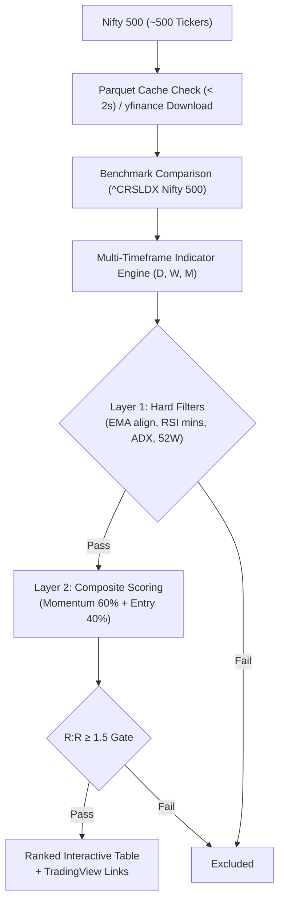
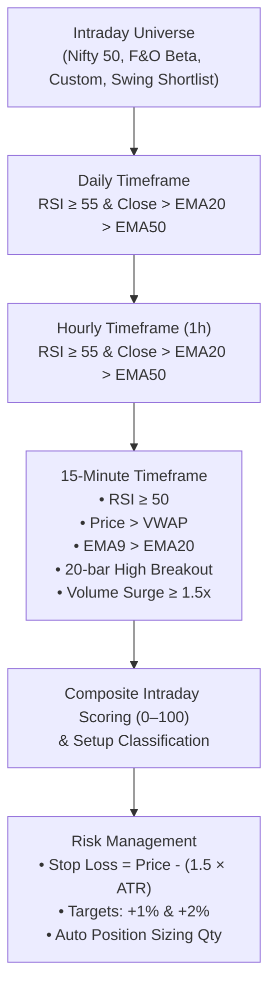

# Nifty Momentum & Intraday Scanner

A **modern, Streamlit-powered** dual-mode stock screener for Indian Equities (NSE) providing both:
1. **🚀 Swing Momentum Scanner (Daily · Weekly · Monthly)** — Scans all Nifty 500 constituents using a two-layer momentum & entry quality scoring engine with local daily Parquet caching (< 3s).
2. **⚡ Intraday MTF Scanner (Daily · Hourly · 15-Minute)** — Real-time multi-timeframe trend alignment, 15m VWAP breakouts, ATR stops, and automatic fractional position sizing.

> **Tech stack**: Python · Streamlit · Pandas · yfinance · NumPy · JetBrains Mono & Inter typography

---

## Key Features

- 🔄 **Unified Dual-Mode Architecture**: Instant toggle between **Swing Momentum Mode** (Nifty 500) and **Intraday MTF Mode** (Presets, High-Beta F&O, Custom watchlists, or top swing candidates).
- 🌓 **Dual-Theme Engine**: Seamless toggle between **Dark Terminal Mode** and **Light Mode** (accessible, WCAG AAA compliant color contrast).
- 📱 **Mobile & Desktop Optimized**: Responsive layout with centered container, intuitive inline controls, and mobile-friendly metrics without hidden sidebars.
- 📊 **6 KPI Summary Cards**: Live counts for BUY Signals, Watchlist setups, Top Score, and Average Risk/Reward ratio.
- ⚡ **Multi-Timeframe Technical Engine**:
  - **Swing**: Daily, Weekly, and Monthly RSI, EMA 20/50/200 structure, ADX (14), and Relative Strength vs Nifty 500.
  - **Intraday**: Daily & Hourly EMA 20/50 alignment, 15m VWAP, EMA 9/20 crossovers, 20-bar high breakouts, and volume surge.
- 🛡️ **Intraday Position Sizing & Risk Management**: Dynamic position sizing calculator based on trade capital, user-defined risk percentage, and 15m ATR stop loss.
- 📈 **Interactive Deep-Dive & Charts**: 15-minute price action vs VWAP, EMA9, and EMA20 line charts with score metric breakdowns.
- 🔗 **Direct TradingView Deep Links**: Click any symbol to open its live chart directly on TradingView.
- 📥 **One-Click CSV Export**: Download dated CSV reports of all screened and scored setups.
- 💾 **Local Parquet Caching**: Automatically caches daily OHLCV data for swing scans — runs in **< 3 seconds**.

---

## Quick Start

```bash
# 1. Create and activate a virtual environment
python -m venv .venv

# Windows
.venv\Scripts\activate
# macOS / Linux
source .venv/bin/activate

# 2. Install dependencies
pip install -r requirements.txt

# 3. Run the scanner
streamlit run streamlit_app.py
```

Open your browser at **http://localhost:8501** (or **http://localhost:8502**).

---

## Scanner Modes

### 1. 🚀 Swing Momentum Scanner (Daily · Weekly · Monthly)

Scans the entire Nifty 500 universe using a two-layer model:



- **Layer 1 (Hard Filters)**: Monthly RSI ≥ 60, Weekly RSI ≥ 60, Daily RSI ≥ 50, Price > EMA20 > EMA50 > EMA200, ADX ≥ 20, Volume Ratio ≥ 1.0x, 3M & 6M returns > 0, 52W distance ≤ 10%.
- **Layer 2 (Composite Scoring)**: Final Score = `0.60 × Momentum Score + 0.40 × Entry Score`.
- **Action Labels**:
  - `🟢 BUY` (Score ≥ 85)
  - `🟢 WATCH / PULLBACK` (Score 75–84)
  - `🟡 WATCHLIST` (Score 65–74)
  - `🔴 AVOID` (Score < 65)

---

### 2. ⚡ Intraday MTF Scanner (Daily · 1h · 15m)

Analyzes intraday price dynamics aligned with higher timeframe momentum:



#### Signals & Setups

| Signal | Criteria |
|---|---|
| `🟢 STRONG BUY CANDIDATE` | Hard filters pass + Intraday Score ≥ 85 |
| `🟢 BUY ON CONFIRMATION` | Hard filters pass + Intraday Score ≥ 75 |
| `🟡 WATCH` | Intraday Score ≥ 65 |
| `🔴 NO TRADE` | Intraday Score < 65 |

| Setup Tag | Pattern Triggers |
|---|---|
| `⚡ BREAKOUT` | Price > Prior 20-bar 15m High + Above VWAP + Volume Surge ≥ 1.5x |
| `🌊 VWAP MOMENTUM` | Above VWAP + EMA9 > EMA20 + 15m RSI ≥ 50 |
| `🔄 PULLBACK / RECLAIM` | Above VWAP + 15m RSI ≥ 50 |
| `⏳ WAIT` | Awaiting confirmation |

#### Position Sizing Formula

$$\text{Quantity} = \left\lfloor \frac{\text{Capital} \times (\text{Risk \%} / 100)}{\text{Price} - \text{Stop Loss}} \right\rfloor$$

---

## Project Structure

```
my-scanner/
├── streamlit_app.py        # Streamlit application UI & dual-mode controller
├── intraday_scanner.py     # Intraday MTF calculation engine & universe presets
├── requirements.txt        # Dependencies (streamlit, yfinance, pandas, numpy, pyarrow)
├── cache/                  # Daily Parquet cache for Nifty 500 prices
└── .specify/               # 📚 Project spec kit
    ├── spec.md             # Full scoring & UI specification
    ├── plan.md             # Architecture & implementation plan
    ├── tasks.md            # Task history & backlog
    └── constitution.md     # Core design principles
```
