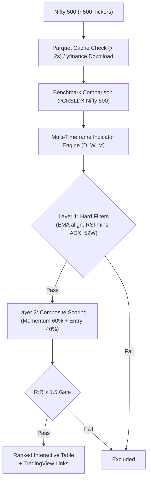
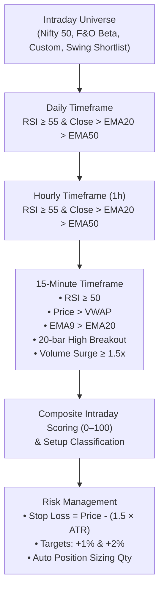
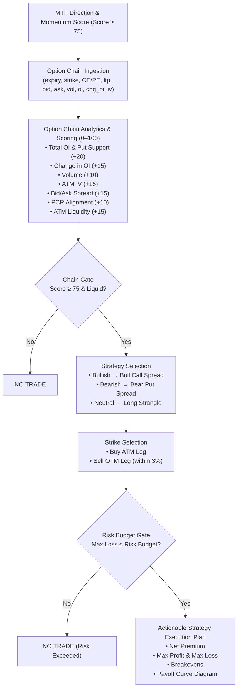

# Nifty Momentum, Intraday & Options Scanner

A **modern, Streamlit-powered** multi-mode stock & derivatives trading screener for Indian Equities (NSE) providing:
1. **🚀 Swing Momentum Scanner (Daily · Weekly · Monthly)** — Scans all Nifty 500 constituents using a two-layer momentum & entry quality scoring engine with local daily Parquet caching (< 3s).
2. **⚡ Intraday MTF Scanner (Daily · Hourly · 15-Minute)** — Real-time multi-timeframe trend alignment, 15m VWAP breakouts, ATR stops, and automatic fractional position sizing.
3. **🎯 Options Chain Strategy Layer (MTF + Chain Gate)** — Multi-Timeframe gated strategy selection (Bull Call Spreads, Bear Put Spreads, Long Strangles), Put-Call Ratio (PCR) analysis, strike selection, and interactive visual payoff curve diagrams.

> **Tech stack**: Python · Streamlit · Pandas · yfinance · NumPy · JetBrains Mono & Inter typography

---

## Key Features

- 🔄 **Unified Tri-Mode Architecture**: Instant toggle between **Swing Momentum Mode** (Nifty 500), **Intraday MTF Mode** (Presets, High-Beta F&O, Custom watchlists), and **Options Strategy Mode** (F&O stocks & indices).
- 🌓 **Dual-Theme Engine**: Seamless toggle between **Dark Terminal Mode** and **Light Mode** (accessible, WCAG AAA compliant color contrast).
- 📱 **Mobile & Desktop Optimized**: Responsive layout with centered container, intuitive inline controls, and mobile-friendly metrics without hidden sidebars.
- 📊 **6 KPI Summary Cards**: Live counts and metric cards tailored for each trading mode.
- ⚡ **Multi-Timeframe Technical Engine**:
  - **Swing**: Daily, Weekly, and Monthly RSI, EMA 20/50/200 structure, ADX (14), and Relative Strength vs Nifty 500.
  - **Intraday**: Daily & Hourly EMA 20/50 alignment, 15m VWAP, EMA 9/20 crossovers, 20-bar high breakouts, and volume surge.
  - **Options**: Directional bias from MTF engine ($\ge 75$), 0–100 Option Chain scoring, PCR analysis, ATM IV & bid/ask spread checks, and max loss risk budgeting.
- 🛡️ **Defined-Risk Option Spreads & Payoffs**: Automated strike selection (Buy ATM + Sell OTM), net premium calculation, max profit/loss, breakevens, risk/reward ratios, and visual payoff diagrams at expiry.
- 📈 **Interactive Deep-Dive & Charts**: 15-minute price action vs VWAP line charts and option chain matrix tables (Calls vs Strikes vs Puts).
- 🔗 **Direct TradingView Deep Links**: Click any symbol to open its live chart directly on TradingView.
- 📥 **One-Click CSV Export**: Download dated CSV reports of screened swing setups, intraday triggers, and options strategies.
- 💾 **Local Parquet Caching**: Automatically caches daily OHLCV data for swing scans — runs in **< 3 seconds**.

---

## Quick Start

```bash
# 1. Create and activate a virtual environment
python -m venv .venv

# Windows
.venv\Scripts\activate
# macOS / Linux
source .venv/bin/activate

# 2. Install dependencies
pip install -r requirements.txt

# 3. Run the scanner
streamlit run streamlit_app.py
```

Open your browser at **http://localhost:8501** (or **http://localhost:8502**).

---

## Scanner Modes

### 1. 🚀 Swing Momentum Scanner (Daily · Weekly · Monthly)

Scans the entire Nifty 500 universe using a two-layer model:



---

### 2. ⚡ Intraday MTF Scanner (Daily · 1h · 15m)

Analyzes intraday price dynamics aligned with higher timeframe momentum:



---

### 3. 🎯 Options Chain Strategy Layer (MTF + Chain Gate)

Evaluates option chains and generates defined-risk option spreads:



#### Strategy & Payoff Formulas

| Strategy | Buy Leg | Sell Leg | Net Premium | Max Loss | Max Profit | Breakeven |
|---|---|---|---|---|---|---|
| **Bull Call Spread** | ATM CE | OTM CE ($+3\%$) | $P_{\text{buy}} - P_{\text{sell}}$ | $\text{Net} \times \text{Lot}$ | $(K_2 - K_1 - \text{Net}) \times \text{Lot}$ | $K_1 + \text{Net}$ |
| **Bear Put Spread** | ATM PE | OTM PE ($-3\%$) | $P_{\text{buy}} - P_{\text{sell}}$ | $\text{Net} \times \text{Lot}$ | $(K_1 - K_2 - \text{Net}) \times \text{Lot}$ | $K_1 - \text{Net}$ |
| **Long Strangle** | OTM CE ($+1.5\%$) | OTM PE ($-1.5\%$) | $P_{\text{call}} + P_{\text{put}}$ | $\text{Net} \times \text{Lot}$ | Unlimited | $K_{\text{call}} + \text{Net}$, $K_{\text{put}} - \text{Net}$ |

---

## Project Structure

```
my-scanner/
├── streamlit_app.py        # Streamlit application UI & tri-mode controller
├── intraday_scanner.py     # Intraday MTF calculation engine & universe presets
├── options_engine.py       # Options chain analysis, strategy selection & payoff engine
├── requirements.txt        # Dependencies (streamlit, yfinance, pandas, numpy, pyarrow)
├── cache/                  # Daily Parquet cache for Nifty 500 prices
└── .specify/               # 📚 Project spec kit
    ├── spec.md             # Full scoring, technical & options specification (v2.5.0)
    ├── plan.md             # Architecture & implementation plan (v2.5.0)
    ├── tasks.md            # Task history & backlog (v2.5.0)
    └── constitution.md     # Core design principles (v2.5.0)
```
