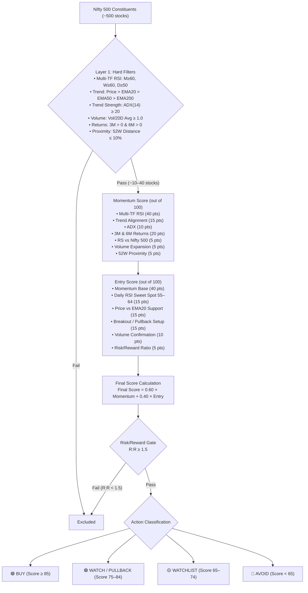

# Swing Momentum Scanner Specification

**Version**: 2.5.0 | **Last Updated**: 2026-08-25

---

## 1. Problem Statement & Target Audience

Traders and quantitative analysts need a fast, reliable, and programmatic swing trading screener for Indian NSE equities that provides swing trading shortlists across all Nifty 500 stocks based on multi-timeframe momentum alignment (Daily, Weekly, Monthly) and entry timing.

- **Target Audience**: Swing Traders scanning the full Nifty 500 universe post-market for high-probability 2–5% multi-day swing setups.

---

## 2. Mode 1: Swing Momentum Scanner (D · W · M)

### 2.1 Architecture Overview

### 2.2 Layer 1 — Hard Filters
- Monthly RSI(14) $\ge 60$, Weekly RSI(14) $\ge 60$, Daily RSI(14) $\ge 50$.
- Price > EMA20 > EMA50 > EMA200.
- ADX(14) $\ge 20$.
- Volume / 20-day avg volume $\ge 1.0$.
- 3-Month & 6-Month Returns $> 0$.
- Distance from 52-Week High $\le 10\%$.

### 2.3 Layer 2 — Composite Scoring
- **Momentum Score (100 pts)**: Monthly RSI (15), Weekly RSI (15), Daily RSI (10), Trend Structure (15), ADX (10), 3M Return (10), 6M Return (10), RS vs Nifty 500 (5), Volume Ratio (5), 52W Distance (5).
- **Entry Score (100 pts)**: Momentum Base (40 pts), Daily RSI setup (15), Price vs EMA20 (15), Breakout/Pullback (15), Volume confirmation (10), Risk/Reward (5).
- **Final Score**: `0.60 × Momentum Score + 0.40 × Entry Score`.
- **R:R Gate**: Setups with R:R $< 1.5$ excluded.

---

## 3. UI & Presentation Specifications
- **Dual-Theme Engine**: Default Light Mode (`#f8fafc`) & Dark Terminal (`#050b14`).
- **3-Mode Switcher**: Radio selector (`🚀 Swing Momentum`, `⚡ Intraday MTF`, `📊 Performance Monitor`).
- **Exporting**: One-click dated CSV download.
- **TV Links**: Direct deep links to TradingView.
