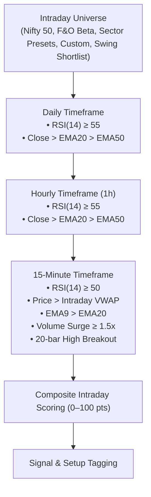

# Intraday Multi-Timeframe Scanner Specification

**Version**: 2.5.0 | **Last Updated**: 2026-08-25

---

## 1. Problem Statement & Target Audience

Traders and quantitative analysts need real-time multi-timeframe trend alignment to trade intraday breakouts and pullbacks with high precision.

- **Target Audience**: Intraday Traders scanning liquid universe subsets during market hours for 15-minute VWAP breakout setups.

---

## 2. Mode 2: Intraday Multi-Timeframe Scanner (Daily · 1h · 15m)

### 2.1 Architecture Overview

### 2.2 Intraday Multi-Timeframe Scoring Matrix

| Timeframe | Factor | Points | Condition |
|---|---|---|---|
| **Daily** | Daily RSI | 30 / 27 / 22 | $\ge 70 \to 30$, $\ge 60 \to 27$, $\ge 55 \to 22$, else 0 |
| **Daily** | Daily Trend | 8 | $\text{Close} > \text{EMA20} > \text{EMA50}$ |
| **Hourly** | Hourly RSI | 20 / 17 / 14 | $\ge 65 \to 20$, $\ge 60 \to 17$, $\ge 55 \to 14$, else 0 |
| **Hourly** | Hourly Trend | 5 | $\text{Close} > \text{EMA20} > \text{EMA50}$ |
| **15-Minute** | 15m RSI | 20 / 17 / 13 | $\ge 60 \to 20$, $\ge 55 \to 17$, $\ge 50 \to 13$, else 0 |
| **15-Minute** | VWAP Support | 5 | $\text{Price} \ge \text{VWAP}$ |
| **15-Minute** | 20-Bar Breakout | 5 | $\text{Price} > \text{High}_{[-21:-1].\max()}$ |
| **15-Minute** | Volume Surge | 10 / 8 / 5 | $\text{Vol Ratio} \ge 2.0\text{x} \to 10$, $\ge 1.5\text{x} \to 8$, $\ge 1.2\text{x} \to 5$ |
| **15-Minute** | 15m Trend | 5 | $\text{Price} > \text{EMA9} > \text{EMA20}$ |
| **Total** | **Max Score** | **100** | Capped at 100.0 pts |

### 2.3 Intraday Signals & Setups

| Signal | Requirement |
|---|---|
| `🟢 STRONG BUY CANDIDATE` | Hard MTF filters pass + Intraday Score $\ge 85$ |
| `🟢 BUY ON CONFIRMATION` | Hard MTF filters pass + Intraday Score $\ge 75$ |
| `🟡 WATCH` | Intraday Score $\ge 65$ |
| `🔴 NO TRADE` | Intraday Score $< 65$ |

| Setup Tag | Trigger Rules |
|---|---|
| `⚡ BREAKOUT` | Price > Prior 20-bar 15m High + Above VWAP + Volume Ratio $\ge$ multiplier |
| `🌊 VWAP MOMENTUM` | Above VWAP + EMA9 > EMA20 + 15m RSI $\ge 50$ |
| `🔄 PULLBACK / RECLAIM` | Above VWAP + 15m RSI $\ge 50$ |
| `⏳ WAIT` | Awaiting confirmation |
